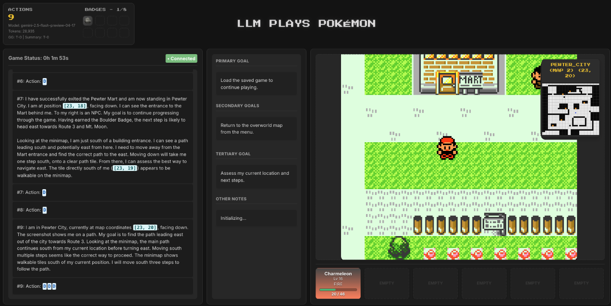
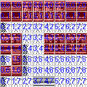
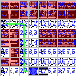
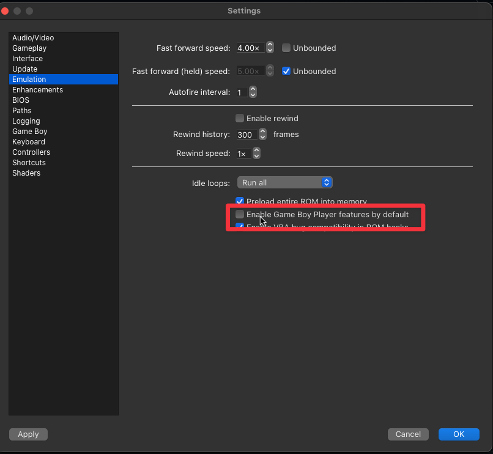

# pokemon-llm

- Currently only supports Gen1 but Gen2 & Gen3 support are planned
- Requires mGBA with scripting autolaunch, [dev builds support this.](https://mgba.io/downloads.html#development-downloads)

## Web UI



> Open web_ui/index.html in your browser. Use streaming software like OBS to add mGBA game feed.

## DUMP MAP IMAGE

python dump.py red.gb 56 -o mart.png -d --start 7,7 --end 0,2

| Normal                          | Debug                          | Path                                | Minimal                          |
| ------------------------------- | ------------------------------ | ----------------------------------- | -------------------------------- |
|  |  |  |  |

## RUN

python run.py --windowed --mode [model-name] [--auto] [--benchmark gymbench.py] [--load_savestate]

If you omit --mode, the program will prompt you to select a mode interactively:

```bash

$ python run.py --windowed --auto --benchmark gymbench.py --load_savestate

No LLM mode specified via command line.
Please choose the LLM mode from the list below:
  1. OPENAI
  2. GEMINI
  3. OLLAMA
  4. LMSTUDIO
  5. GROQ
  6. TOGETHER
  7. GROK
  8. ANTHOPIC
Enter the number of your choice: 1
Great! You selected: OPENAI

```

> Configure mGBA not to use GB Player features.


